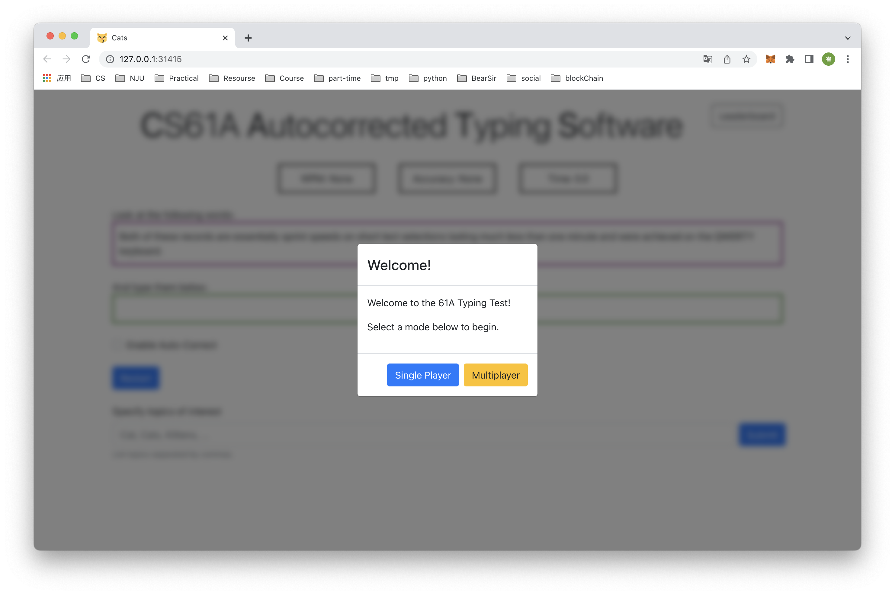
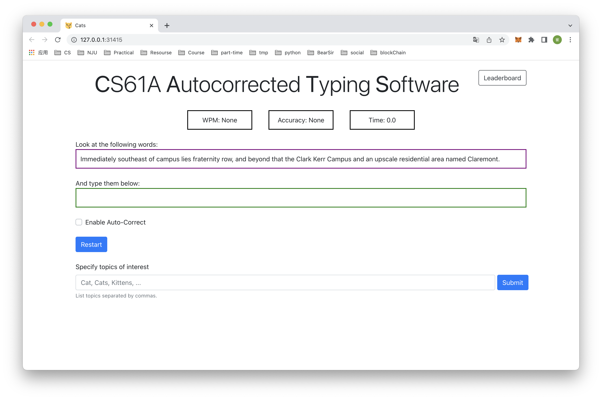
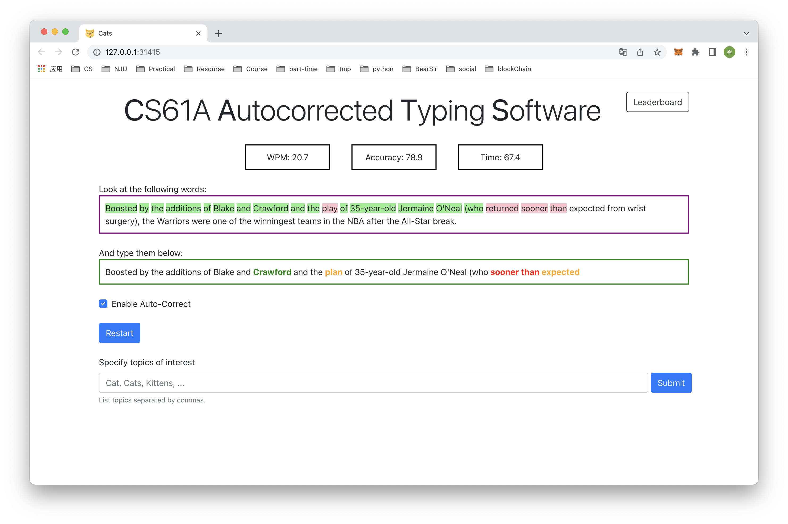

# Project 2: Autocorrected Typing Software


> Adapted from cs61a of UC Berkeley.


<center>Programmers dream of Abstraction, recursion, and Typing really fast.</center>


## Introduction

In this project, you will write a program that measures typing speed. Additionally, you will implement typing autocorrect, which is a feature that attempts to correct the spelling of a word after a user types it.


## Final Product

When you finish the project, you'll have implemented a significant part of this game yourself!

You can have an exploration of it by doing this:

```shell
cd solution
python3 gui.py
```

> You will get a graphic user interface in your local browser with game logic implemented in my solution.








## Download starter files

To get started, download all of the project code.

```shell
git clone https://github.com/JacyCui/sicp-proj02.git
cd sicp-proj02
unzip cats.zip
```

Below is a list of all the files you will see in the archive `cats.zip`. However, you only have to make changes to `cats.py`.

- `cats.py`: The typing test logic.

- `utils.py`: Utility functions for interacting with files and strings.

- `ucb.py`: Utility functions for SICP projects.

    > UCB stands for UC Berkeley.

- `data/sample_paragraphs.txt`: A file containing text samples to be typed. These are [scraped](https://github.com/kavigupta/wikivideos/blob/626de521e04ca643751ed85d549faca6ea528b1d/get_corpus.py) Wikipedia articles about various topics.

- `data/common_words.txt`: A file containing common [English words in order of frequency](https://github.com/first20hours/google-10000-english/blob/master/google-10000-english-usa-no-swears.txt).

- `data/words.txt`: A file containing many more [English words in order of frequency](https://github.com/first20hours/google-10000-english/blob/master/google-10000-english-usa-no-swears.txt).

- `gui.py`: A web server for the web-based graphical user interface (GUI).

- `gui_files`: A directory of files needed for the graphical user interface (GUI).

- `images`: A directory of images.

- `ok`, `proj02.ok`, `tests`: Testing files.

In the folder `solution` is my version of solution for cats project. You may not refer to it before you've finished the entire project.


## Logistics

You will turn in the following files:

- `cats.py`

You do not need to modify or turn in any other files to complete the project. 

For the functions that we ask you to complete, there may be some initial code that we provide. If you would rather not use that code, feel free to delete it and start from scratch. You may also add new function definitions as you see fit.

However, please do **not** modify any other functions. Doing so may result in your code failing our autograder tests. Also, please do not change any function signatures (names, argument order, or number of arguments).

Throughout this project, you should be testing the correctness of your code. It is good practice to test often, so that it is easy to isolate any problems. However, you should not be testing *too* often, to allow yourself time to think through problems.

We have provided an **autograder** called `ok` to help you with testing your code and tracking your progress.

The primary purpose of `ok` is to test your implementations.

As you are not a student of UC Berkeley, You should always run `ok` like this:

```shell
python3 ok --local
```

If you want to test your code interactively, you can run

```shell
 python3 ok -q [question number] -i --local
```

with the appropriate question number (e.g. `01`) inserted. This will run the tests for that question until the first one you failed, then give you a chance to test the functions you wrote interactively.

You can also use the debug printing feature in OK by writing

```python
 print("DEBUG:", x)
```

which will produce an output in your terminal without causing OK tests to fail with extra output.


## Phase 1: Typing

### Problem 1

Implement `choose`, which selects which paragraph the user will type. It takes a list of `paragraphs` (strings), a `select` function that returns `True` for paragraphs that can be selected, and a non-negative index `k`. The `choose` function return's the `k`th paragraph for which `select` returns `True`. If no such paragraph exists (because `k` is too large), then `choose` returns the empty string.

Before writing any code, unlock the tests to verify your understanding of the question.

```shell
python3 ok -q 01 -u --local
```

Once you are done unlocking, begin implementing your solution. You can check your correctness with:

```shell
python3 ok -q 01 --local
```


### Problem 2

Implement `about`, which takes a list of `topic` words. It returns a function which takes a paragraph and returns a boolean indicating whether that paragraph contains any of the words in `topic`. The returned function can be passed to `choose` as the `select` argument.

To make this comparison accurately, you will need to ignore case (that is, assume that uppercase and lowercase letters don't change what word it is) and punctuation in the paragraph.

Assume that all words in the `topic` list are already lowercased and do not contain punctuation.

> **Hint**: You may use the string utility functions in `utils.py`.

Before writing any code, unlock the tests to verify your understanding of the question.

```shell
python3 ok -q 02 -u --local
```

Once you are done unlocking, begin implementing your solution. You can check your correctness with:

```shell
python3 ok -q 02 --local
```


### Problem 3

Implement `accuracy`, which takes a `typed` paragraph and a `reference` paragraph. It returns the percentage of words in `typed` that exactly match the corresponding words in `reference`. Case and punctuation must match as well.

A *word* in this context is any sequence of characters separated from other words by whitespace, so treat "dog;" as all one word.

If a typed word has no corresponding word in the reference because `typed` is longer than `reference`, then the extra words in `typed` are all incorrect.

If `typed` is empty, then the accuracy is zero.

Before writing any code, unlock the tests to verify your understanding of the question.

```shell
python3 ok -q 03 -u --local
```

Once you are done unlocking, begin implementing your solution. You can check your correctness with:

```shell
python3 ok -q 03 --local
```


### Problem 4

Implement `wpm`, which computes the *words per minute*, a measure of typing speed, given a string `typed` and the amount of `elapsed` time in **seconds.** Despite its name, *words per minute* is not based on the number of words typed, but instead the number of characters, so that a typing test is not biased by the length of words. The formula for *words per minute* is the ratio of the number of characters (including spaces) typed divided by 5 (a typical word length) to the elapsed time in **minutes.**

For example, the string `"I am glad!"` contains three words and ten characters (not including the quotation marks). The words per minute calculation uses 2 as the number of words typed (because 10 / 5 = 2). If someone typed this string in 30 seconds (half a minute), their speed would be 4 words per minute.

Before writing any code, unlock the tests to verify your understanding of the question.

```shell
python3 ok -q 04 -u --local
```

Once you are done unlocking, begin implementing your solution. You can check your correctness with:

```shell
python3 ok -q 04 --local
```


**Time to test your typing speed!** You can use the command line to test your typing speed on paragraphs about a particular topic. For example, the command below will load paragraphs about cats or kittens. See the `run_typing_test` function for the implementation if you're curious (but it is defined for you).

```shell
python3 cats.py -t cats kittens
```

You can try out the web-based graphical user interface (GUI) using the following command.

```shell
python3 gui.py
```


## Phase 2: Autocorrect

In the web-based GUI, there is an autocorrect button, but right now it doesn't do anything. Let's implement automatic correction of typos. Whenever the user presses the space bar, if the last word they typed doesn't match a word in the dictionary but is close to one, then that similar word will be substituted for what they typed.


### Problem 5

Implement `autocorrect`, which takes a `user_word`, a list of all `valid_words`, a `diff_function`, and a `limit`.

If the `user_word` is contained inside the `valid_words` list, `autocorrect` returns that word. Otherwise, `autocorrect` returns the word from `valid_words` that has the lowest difference from the provided `user_word` based on the `diff_function`. However, if the lowest difference between `user_word` and any of the `valid_words` is greater than `limit`, then `user_word` is returned instead.

A diff function takes in three arguments. The first two arguments are the two strings to be compared (the `user_word` and a word from `valid_words`), and the third argument is the `limit`. The output of the diff function, which is a number, represents the amount of difference between the two strings.

Here is an example of a diff function that computes the minimum of `1 + limit` and the difference in length between the two input strings:

```python
>>> def length_diff(w1, w2, limit):
...     return min(limit + 1, abs(len(w2) - len(w1)))
>>> length_diff('mellow', 'cello', 10)
1
>>> length_diff('hippo', 'hippopotamus', 5)
6
```

Assume that `user_word` and all elements of `valid_words` are lowercase and have no punctuation.

**Important**: if multiple strings have the same lowest difference according to the `diff_function`, `autocorrect` should return the string that appears first in `valid_words`.

> **Hint**: Try using `max` or `min` with the optional `key` argument.

Before writing any code, unlock the tests to verify your understanding of the question.

```shell
python3 ok -q 05 -u --local
```

Once you are done unlocking, begin implementing your solution. You can check your correctness with:

```shell
python3 ok -q 05 --local
```


### Problem 6

Implement `shifty_shifts`, which is a diff function that takes two strings. It returns the minimum number of characters that must be changed in the `start` word in order to transform it into the `goal` word. If the strings are not of equal length, the difference in lengths is added to the total.

**Important**: You may not use `while` or `for` statements in your implementation. Use recursion.

Here are some examples:

```python
>>> big_limit = 10
>>> shifty_shifts("nice", "rice", big_limit)    # Substitute: n -> r
1
>>> shifty_shifts("range", "rungs", big_limit)  # Substitute: a -> u, e -> s
2
>>> shifty_shifts("pill", "pillage", big_limit) # Don't substitute anything, length difference of 3.
3
>>> shifty_shifts("roses", "arose", big_limit)  # Substitute: r -> a, o -> r, s -> o, e -> s, s -> e
5
>>> shifty_shifts("rose", "hello", big_limit)   # Substitute: r->h, o->e, s->l, e->l, length difference of 1.
5
```

If the number of characters that must change is greater than `limit`, then `shifty_shifts` should return any number larger than `limit` and should minimize the amount of computation needed to do so.

These two calls to `shifty_shifts` should take about the same amount of time to evaluate:

```python
>>> limit = 4
>>> shifty_shifts("roses", "arose", limit) > limit
True
>>> shifty_shifts("rosesabcdefghijklm", "arosenopqrstuvwxyz", limit) > limit
True
```

Before writing any code, unlock the tests to verify your understanding of the question.

```shell
python3 ok -q 06 -u --local
```

Once you are done unlocking, begin implementing your solution. You can check your correctness with:

```shell
python3 ok -q 06 --local
```

Try turning on autocorrect in the GUI. Does it help you type faster? Are the corrections accurate? You should notice that inserting a letter or leaving one out near the beginning of a word is not handled well by this diff function. Let's fix that!


### Problem 7

Implement `pawssible_patches`, which is a diff function that returns the minimum number of edit operations needed to transform the `start` word into the `goal` word.

There are three kinds of edit operations:

1. Add a letter to `start`,
2. Remove a letter from `start`,
3. Substitute a letter in `start` for another.

Each edit operation contributes 1 to the difference between two words.

```python
>>> big_limit = 10
>>> pawssible_patches("cats", "scat", big_limit)       # cats -> scats -> scat
2
>>> pawssible_patches("purng", "purring", big_limit)   # purng -> purrng -> purring
2
>>> pawssible_patches("ckiteus", "kittens", big_limit) # ckiteus -> kiteus -> kitteus -> kittens
3
```

We have provided a template of an implementation in `cats.py`. This is a recursive function with three recursive calls. One of these recursive calls will be similar to the recursive call in `shifty_shifts`.

You may modify the template however you want or delete it entirely.

If the number of edits required is greater than `limit`, then `pawssible_patches` should return any number larger than `limit` and should minimize the amount of computation needed to do so.

These two calls to `pawssible_patches` should take about the same amount of time to evaluate:

```python
>>> limit = 2
>>> pawssible_patches("ckiteus", "kittens", limit) > limit
True
>>> pawssible_patches("ckiteusabcdefghijklm", "kittensnopqrstuvwxyz", limit) > limit
True
```

There are no unlock cases for this problem. Make sure you understand the above test cases!

Test your implementation before proceeding:

```shell
python3 ok -q 07 --local
```

Try typing again. Are the corrections more accurate?

```shell
python3 gui.py
```

**Extensions:** You may optionally design your own diff function called `final_diff`. Here are some ideas for making even more accurate corrections:

- Take into account which additions and deletions are more likely than others. For example, it's much more likely that you'll accidentally leave out a letter if it appears twice in a row.
- Treat two adjacent letters that have swapped positions as one change, not two.
- Try to incorporate common misspellings


## Phase 3: Multiplayer

Typing is more fun with friends! You'll now implement multiplayer functionality, so that when you run `gui.py` on your computer, it connects to the course server at [cats.cs61a.org](https://cats.cs61a.org/) and looks for someone else to race against.

To race against a friend, 5 different programs will be running:

- Your GUI, which is a program that handles all the text coloring and display in your web browser.
- Your `gui.py`, which is a web server that communicates with your GUI using the code you wrote in `cats.py`.
- Your opponent's `gui.py`.
- Your opponent's GUI.
- The CS 61A multiplayer server, which matches players together and passes messages around.

When you type, your GUI sends what you have typed to your `gui.py` server, which computes how much progress you have made and returns a progress update. It also sends a progress update to the multiplayer server, so that your opponent's GUI can display it.

Meanwhile, your GUI display is always trying to keep current by asking for progress updates from `gui.py`, which in turn requests that info from the multiplayer server.

Each player has an `id` number that is used by the server to track typing progress.


### Problem 8

Implement `report_progress`, which is called every time the user finishes typing a word. It takes a list of the words `typed`, a list of the words in the `prompt`, the user's `user_id`, and a `send` function that is used to send a progress report to the multiplayer server. Note that there will never be more words in `typed` than in `prompt`.

Your progress is a ratio of the words in the `prompt` that you have typed correctly, up to the first incorrect word, divided by the number of `prompt` words. For example, this example has a progress of `0.25`:

```python
report_progress(["Hello", "ths", "is"], ["Hello", "this", "is", "wrong"], ...)
```

Your `report_progress` function should return this number. Before that, it should send a message to the multiplayer server that is a two-element dictionary containing the keys `'id'` and `'progress'`. The `user_id` is passed into `report_progress` from the GUI. The progress is the fraction you compute. Call `send` on this dictionary to send it to the multiplayer server.

Before writing any code, unlock the tests to verify your understanding of the question.

```shell
python3 ok -q 08 -u --local
```

Once you are done unlocking, begin implementing your solution. You can check your correctness with:

```shell
python3 ok -q 08 --local
```


### Problem 9

Implement `time_per_word`, which takes in `times_per_player`, a list of lists for each player with timestamps indicating when each player finished typing each word. It also takes in a list `words`. It returns a `game` with the given information.

A `game` is a data abstraction that has a list of `words` and `times`. The `times` are stored as a list of lists of how long it took each player to type each word. `times[i][j]` indicates how long it took player `i` to type word `j`.

Timestamps are cumulative and always increasing, while the values in `time` are differences between consecutive timestamps. For example, if `times_per_player = [[1, 3, 5], [2, 5, 6]]`, the corresponding `time` attribute of the `game` would be `[[2, 2], [3, 1]]` (`(3-1)`, `(5-3)` and `(5-2)`, `(6-5)`). Note that the first value of each list within `times_per_player` represents the initial starting time for each player.

Be sure to use the `game` constructor when returning a `game`, rather than assuming a particular data format. Read the definitions for the `game` constructor and selectors in `cats.py` to learn more about how the data abstraction is implemented.

Before writing any code, unlock the tests to verify your understanding of the question.

```shell
python3 ok -q 09 -u --local
```

Once you are done unlocking, begin implementing your solution. You can check your correctness with:

```shell
python3 ok -q 09 --local
```


### Problem 10

Implement `fastest_words`, which returns which words each player typed fastest. This function is called once both players have finished typing. It takes in a `game`.

The `game` argument is a `game` data abstraction, like the one returned in Problem 9. You can access words in the `game` with selectors `word_at`, which takes in a `game` and the `word_index` (an integer). You can access the time it took any player to type any word using `time`.

The `fastest_words` function returns a list of lists of words, one list for each player, and within each list the words they typed the fastest (against all the other players). In the case of a tie, consider the earliest player in the list (the smallest player index) to be the one who typed it the fastest.

Be sure to use the accessor functions for the `game` data abstraction, rather than assuming a particular data format.

Before writing any code, unlock the tests to verify your understanding of the question.

```shell
python3 ok -q 10 -u --local
```

Once you are done unlocking, begin implementing your solution. You can check your correctness with:

```shell
python3 ok -q 10 --local
```


## Conclusion

At this point, run the entire autograder to see if there are any tests that don't pass.

```shell
python3 ok --local
```

Congratulations! Now you can play against other students in the course. Set `enable_multiplayer` to `True` near the bottom of `cats.py` and type swiftly!

Unfortunately, you might not be able to find an opponent since there aren't many people doing the project at the same time. You can test the multiplayer function using two computers by yourself or using several virtual machines.

This the end of the second project of SICP! 

You've been half-way to the success of the SICP, Bravo!


